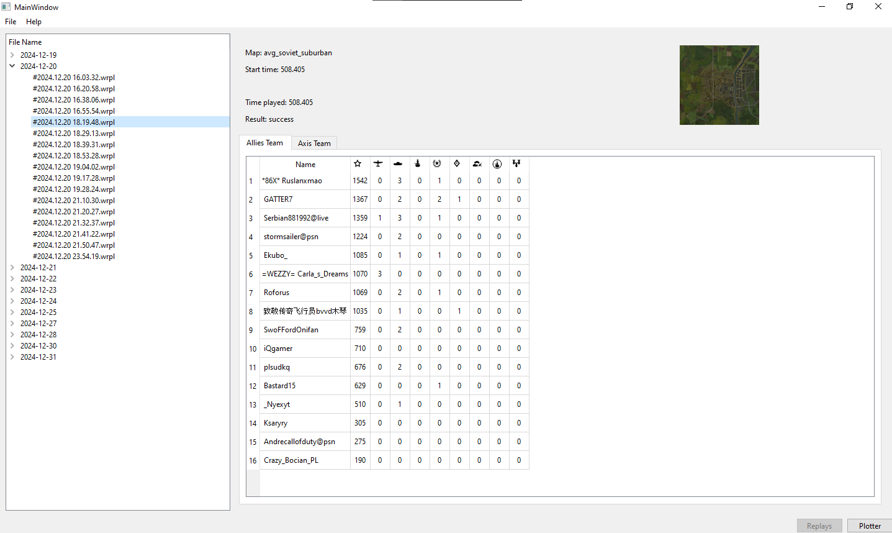
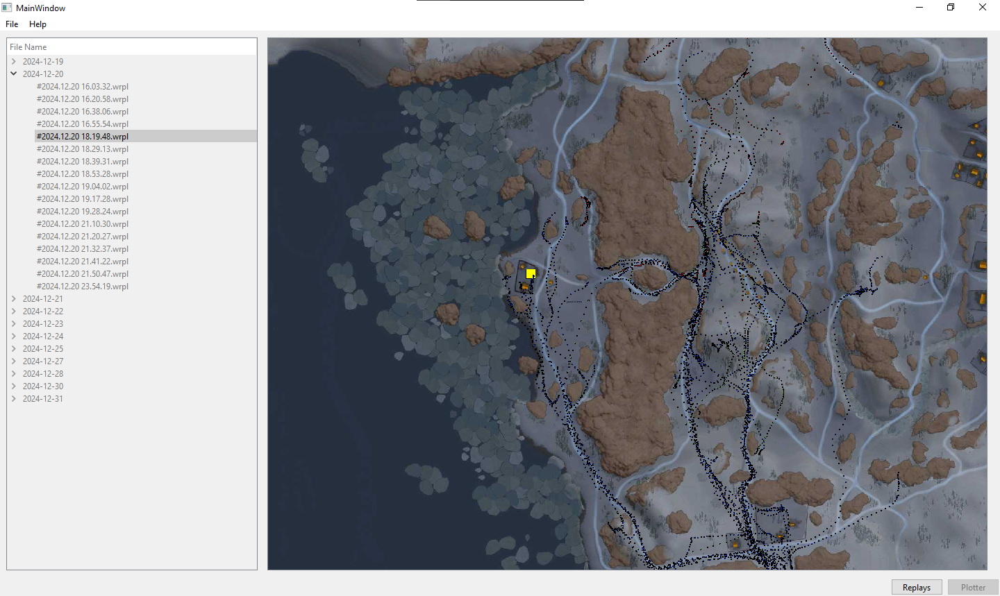

# WT-Plotter

A simple application to display the contents of War Thunder's replay files, even older ones.
Huge thanks to [FlareFlo](https://github.com/FlareFlo) for his work on the [wt_ext_cli](https://github.com/Warthunder-Open-Source-Foundation/wt_ext_cli)
> **Note:** This project is still in development and many things need to be finished/polished, expect bugs.

## Features

- Display replay metadata such as the map, game mode, date and if the player won or lost.
- Display result leaderboard for both allies and axis teams with all possible information.
- Ability to record players'positions in an ongoing match to later display them in a map or contribute to my other project [WT-Heatmaps](http://warthunder-heatmaps.crabdance.com/).

**Planned features:**

- Display each player used/unused vehicles.
- Image export of the player's path in the map.
- Replay data export/persistence using a local database.
- Open arbitrary replays.
- Linux/MacOS support if requested.

## How to use

1. Download the latest release from the releases page.
2. Unzip the archive in an empty folder.
3. Open the executable.
4. From the `File` menu select `Preferences` and set the path to your War Thunder replays directory. Click OK.
5. Restart the app.
6. The left side of the application will show a list of all the replays in the directory that can be read.
7. Select a replay from the list and the right side of the application will show the contents of the replay.