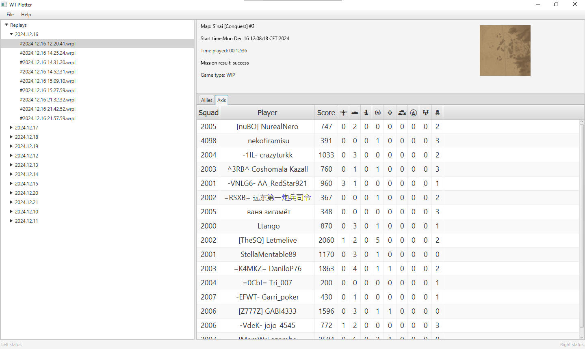
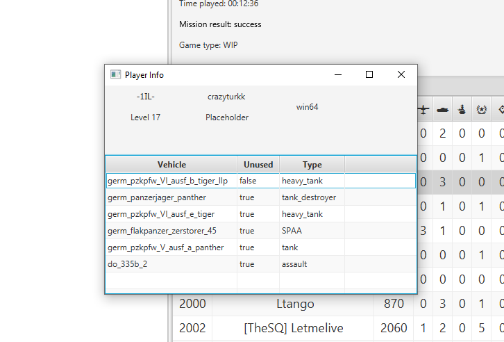

# WT-Plotter

A simple application to display the contents of War Thunder's replay files, even older ones.
Huge thanks to [FlareFlo](https://github.com/FlareFlo) for his work on the [wt_ext_cli](https://github.com/Warthunder-Open-Source-Foundation/wt_ext_cli)
> **Note:** This project is still in development and many things need to be finished/polished, expect bugs.

## Features

- Display replay metadata such as the map, game mode, date and if the player won or lost.
- Display result leaderboard for both allies and axis teams with all possible information.
- Display each player used/unused vehicles.

**Planned features:**
- UTF-8 support for player names.
- Ability to record players'positions in an ongoing match to later display them in a map or contribute to my other project [WT-Heatmaps]("http://warthunder-heatmaps.crabdance.com/").
- Image export of the player's path in the map.
- Replay data export/persistence using a local database.
- Linux/MacOS support if requested.

## How to use

1. Download the latest release from the releases page.
2. Install the application.
3. Open the application.
4. From the `File` menu select `Preferences` and set the path to your War Thunder replays directory.
5. The left side of the application will show a list of all the replays in the directory that can be read.
6. Select a replay from the list and the right side of the application will show the contents of the replay.
7. Right-click on the leaderboard to visualize the player's vehicles.

# Contributing
## IntelliJ

IntelliJ will happily configure itself from a Gradle build. 

1. Open IntelliJ
2. File -> Open
3. In the file chooser dialog select the directory that contains the local repository and press the `Open` button. 
IntelliJ will notice the directory has a `build.gradle` in it and then do its thing and in a few minutes you should be good to go.
4. To run it go to `SuperMain.java` and press the green arrow in the gutter next to the class name or 
next to the `main()` method. Or you can open a terminal and execute `./gradlew run`

## Gradle

The project includes the [Gradle Wrapper](https://docs.gradle.org/current/userguide/gradle_wrapper.html) so no local installation of Gradle is needed. 

## Tasks

* `./gradlew run` -- Pretty self explantory, will run the application. 
* `./gradlew jpackage` -- Will package your app with a bundled runtime in a platform specific format. After this runs check the `build/jpacakge` directory for the bundled runtimes.
