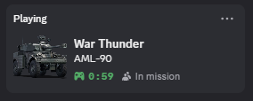
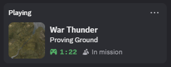
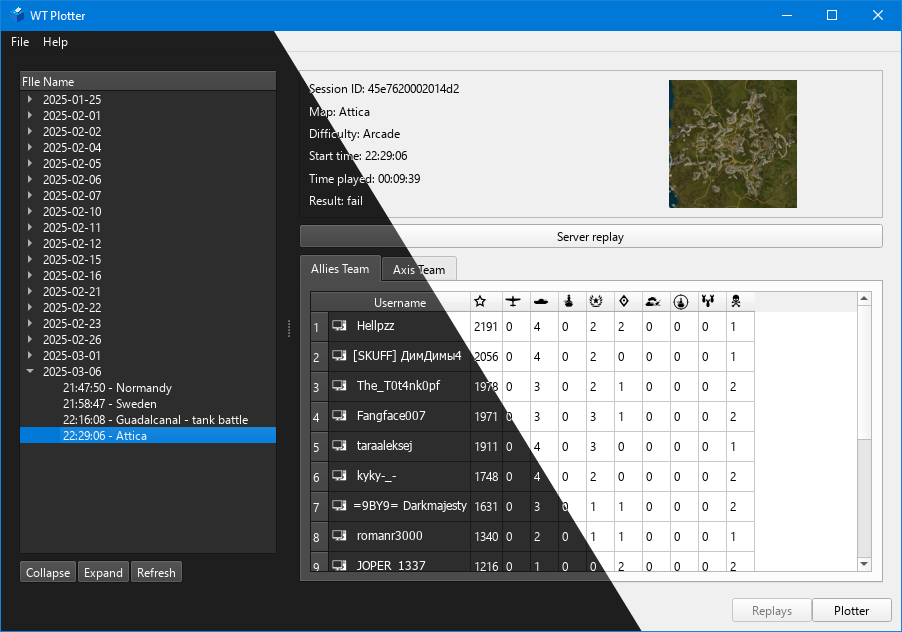
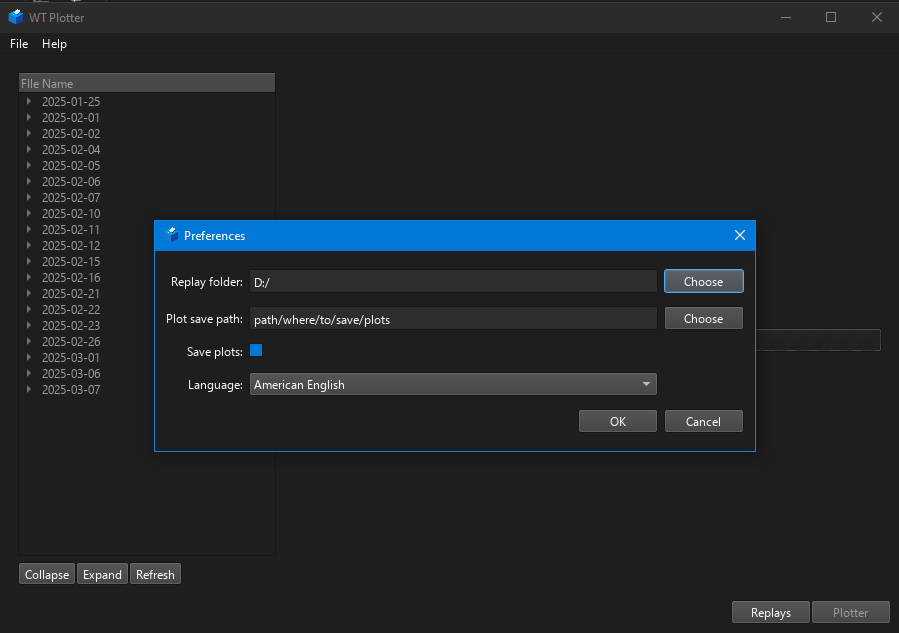
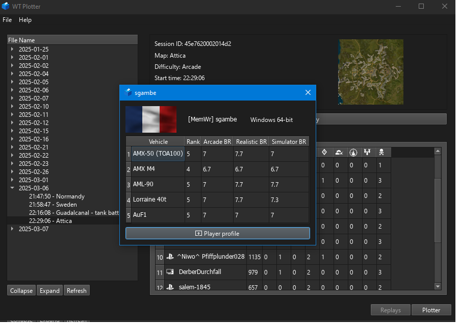
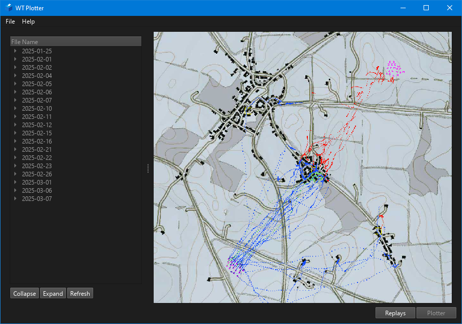

# WT-Plotter

WT-Plotter is a lightweight application designed to parse and display information from War Thunder replay files, including older versions. Special thanks to [FlareFlo](https://github.com/FlareFlo) for his  [wt_ext_cli](https://github.com/Warthunder-Open-Source-Foundation/wt_ext_cli) project, as well as Klensy and Kotiq for their work on replay file parsing.

**Note:** This project is still under active development. Some features may be incomplete or contain bugs. Feedback and contributions are welcome!

---

## Key Features

- **Replay Metadata:** View essential details such as map name, game mode, difficulty, session ID, match date, and match outcome (win/loss).
- **Leaderboard Analysis:** Explore detailed results for both Allied and Axis teams, including:
  - Player and AI kills
  - Deaths and assists
  - Bomb damage to bases
  - Naval damage
  - Zones captured
- **Player Information:** Check player platform, vehicle lineups and country used.
- **Local Database:** Store replay data persistently for easy access and analysis.
- **Multi-Language Support:** English and Russian translations (Russian translations may need refinement—contributions are appreciated!).
- **Live Match Tracking:** Record player positions during an ongoing match for later visualization ~~or contribution to the [WT-Heatmaps](https://warthunder-heatmaps.crabdance.com/) project.~~ _WT-Heatmaps project is no longer active_
- **Discord RPC Integration:** Display your vehicle and the map you are playing as Discord activity.

  
  

The application now supports dark mode, with automatic theme switching based on your system preferences.

---

## Planned Features

- **Open Arbitrary Replays:** Load replay files from any location.
- **MacOS Support:** If there's enough demand, MacOS compatibility will be added.

---

## Getting Started

1. **Download:** Grab the latest release from the [Releases page](https://github.com/Sgambe33/WT-Plotter/releases/tag/latest).
2. **Install:** Run the installer on Windows or the AppImage on Linux.
3. **Enable Replay Autosave:** Ensure the "Autosave Replays" setting is enabled in War Thunder.
4. **Launch WT-Plotter:** Start the application.
5. **Set Preferences:**
   - Go to `File > Preferences`.
   - Set the path to your War Thunder replays directory.
   - Optionally, enable automatic map saving.

6. **Load Replays:** The application will scan and store replays in a local database. The left panel will display a list of available replays.
7. **Analyze Replays:** Select a replay to view its details on the right side. Double-click a player's name to open their profile dialog.

---

## Technical Insights

WT-Plotter currently extracts basic information from replay files. Advanced data, such as player positions, remains in an undecoded format. All parsed data is stored locally in the `wtplotter` folder within your documents directory:

- **Database:** A SQLite database stores replay data. Avoid modifying its structure to prevent compatibility issues.
- **Exported Maps:** Maps are saved in the same directory as the database by default.
- **Position Tracking:** Player positions are fetched using War Thunder's localhost:8111 API. This method is safe and does not risk account bans.

---

## Disclaimer

This project is not affiliated with or endorsed by Gaijin Entertainment. War Thunder is a registered trademark of Gaijin Entertainment. All rights reserved.

---

Feel free to contribute, report issues, or suggest improvements! Your feedback helps make WT-Plotter better for the War Thunder community.
